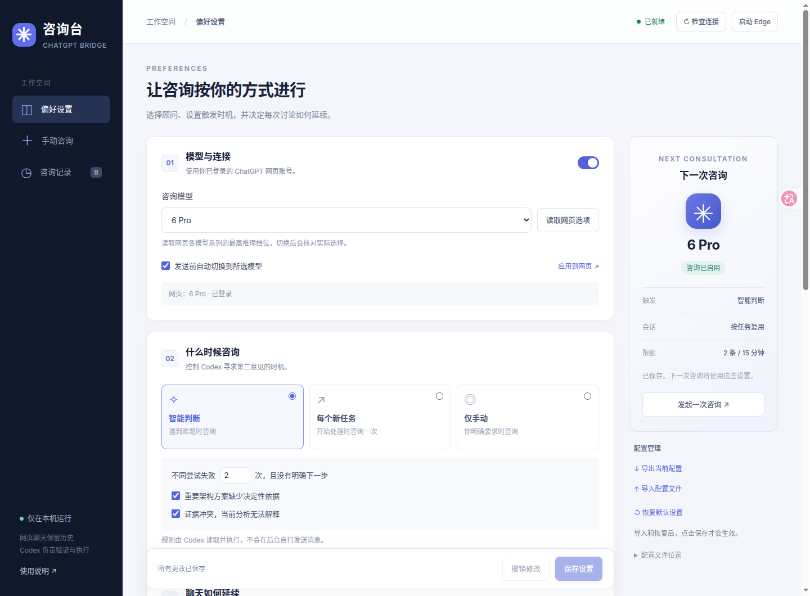

# Codex ChatGPT Bridge

让 Codex 在需要第二意见时，咨询你已登录的 **ChatGPT 网页聊天**，并把讨论保留在网页历史中。

一个运行在 Linux 桌面的轻量咨询台：选择模型、设置触发条件、管理会话和提示词，再由 Codex 验证顾问的建议。无需模型 API Key，无前端构建步骤，无第三方运行时 npm 依赖。

**实验性、非 OpenAI 官方项目。当前适配 Linux + Microsoft Edge + 中文 ChatGPT 页面。** 模型可用性取决于账号；网页结构改变时可能需要更新适配。



截图展示已启用智能模式的示例；首次安装默认为仅手动。

## 能做什么

- **真实网页聊天**：咨询结果保留 ChatGPT 原聊天链接，可继续在网页查看和讨论。
- **配置驱动**：选择网页可用模型，发送前自动切换并核对页面标签。
- **三种触发方式**：智能判断、每个新任务一次、仅手动；支持暂停。
- **会话管理**：按任务复用、每次新建、跨任务复用最近聊天，以及可选新标签页。
- **可调提示词与预算**：首条或每条附加说明、发送次数、等待时长、材料长度。
- **记录与恢复**：查询进度、续问、导出、归档；相同请求 ID 不盲目重发。
- **本地控制台**：配置导入导出，检测浏览器连接、登录状态与所选模型。

## 安装

需要 Linux 图形桌面、Node.js 22 或更高版本、Microsoft Edge（`/usr/bin/microsoft-edge`）、`bash`、`flock` 和 `xdg-open`。首次登录由你在专用浏览器中完成。其他系统、浏览器、界面语言尚未验证。

下载本仓库，进入目录运行：

```bash
node scripts/install.mjs
~/.local/bin/chatgpt-pro-manager
```

安装不需要 sudo，不下载依赖。配置页地址是 **http://127.0.0.1:9230/**，应用菜单中也会出现“ChatGPT 咨询管理”。

1. 在咨询台点击“启动 Edge”，进入专用浏览器并登录 ChatGPT。
2. 使用中文 ChatGPT 界面，先手动选好你有权使用的模型。
3. 点击“读取网页选项”，选择咨询模型，保存设置。
4. 在“手动咨询”提交一个简单问题，确认结果和原聊天链接。
5. 重启 Codex，让它发现安装的 `chatgpt-pro-consult` Skill。

**初装默认仅手动咨询。** 在 Codex 中明确说“使用 $chatgpt-pro-consult 帮我咨询这个问题”即可。若希望每个任务都检查触发策略，显式启用自动入口：

```bash
node scripts/install.mjs --enable-auto
```

这个选项会向个人 `~/.codex/AGENTS.md` 添加有标记的规则，并在**首次安装**时使用智能模式。已有配置始终保留；如果先默认安装再启用自动入口，请在页面把“仅手动”改成“智能判断”或“每个新任务”。安装器保留原有个人规则，并备份首次修改前的内容。

智能模式依据失败次数、重要架构取舍和证据冲突触发。“每个新任务”是每项新任务首次处理时咨询一次。它们由 **Codex 读取 Skill 和策略执行**，不是后台监听器，也不保证每个客户端都强制执行；新会话或重新读取规则后生效。

## 数据放在哪里

| 内容 | 默认位置 |
| --- | --- |
| 程序 | `~/.local/share/codex-chatgpt-bridge/` |
| 配置及上个版本 | `~/.config/codex-chatgpt-bridge/config.json` / `.bak` |
| 问答、配置快照及日志 | `~/.local/state/codex-chatgpt-bridge/` |
| 专用 Edge 登录资料 | `~/.local/share/codex-chatgpt-edge/` |
| Codex Skill | `~/.codex/skills/chatgpt-pro-consult/` |

网页咨询会将你选择的材料发送到 ChatGPT。项目本身无遥测，但问答和浏览器登录资料属于私人数据，不应上传到代码仓库。仅在本机使用；不要将管理端口 `9230` 或浏览器调试端口 `9222` 转发到公网。保留浏览器资料通常可以延续登录状态，登录过期仍需本人重新登录。

## 更新与卸载

```bash
# 更新仓库代码后重新安装；配置和历史保留
node scripts/install.mjs

# 移除程序、启动器、Skill 和本项目添加的 AGENTS 规则
node scripts/install.mjs --uninstall
```

卸载保留配置、问答和专用浏览器资料。先关闭专用 Edge 和管理服务再卸载；安装器不会结束其他浏览器或服务。若发现同名但非本安装器管理的文件，安装会停止，请先自行备份和迁移。

## 开发与测试

```bash
npm test
```

自动测试无需浏览器、账号或网络，覆盖策略判定、配置校验与冲突处理、隔离安装、重复升级及卸载保留数据。测试使用临时目录，不修改你的实际安装。

真实浏览器验收需人工登录，见 [验收步骤](docs/testing.md)。原型曾完成 37 项本机检查和 4 次真实问答；这不等于本仓库 CI 覆盖了网页行为。发布版的测试结果记录在 [发布检查](docs/release-checks.md)。

- [详细使用与恢复](docs/usage.zh-CN.md)
- [配置示例](examples/config.example.json)
- [贡献说明](CONTRIBUTING.md)
- [更新记录](CHANGELOG.md)

## 设计边界

网页模型标签是界面证据，不能独立证明后端模型身份。当前模型扫描读取各模型系列最高推理档位；不保证穷举所有档位。发送后状态不确定时继续查询同一个 ID，本地防重复机制不构成服务端严格 exactly-once 保证。提示词作为用户消息发送，不是后端系统提示词。收到的建议仍需 Codex 在本地核验。

本项目采用 [MIT License](LICENSE)。
