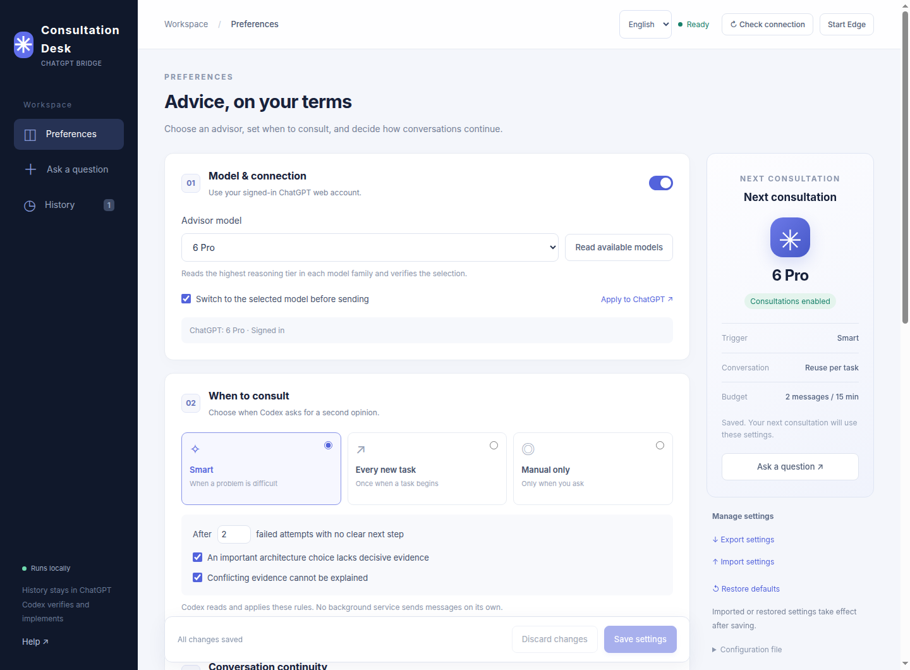

# Codex ChatGPT Bridge

**English** | [简体中文](README.zh-CN.md)

Let Codex ask your signed-in **ChatGPT web chat** for a second opinion, with conversations preserved in your ChatGPT history.

A lightweight Linux desktop consultation panel: choose a model, configure triggers, manage conversations and prompts, and let Codex verify the advice locally. No model API key, frontend build step, or third-party runtime npm dependencies.

**Experimental and unofficial; not affiliated with OpenAI.** The browser adapter currently targets Linux + Microsoft Edge + the **Chinese ChatGPT interface**. Available models depend on your account. Website changes may require adapter updates.



The panel supports **English and Simplified Chinese** using the selector at the top right. Your choice is saved in this browser. Switching the panel language does not translate prompts, change the model, or alter chat content. The screenshot shows smart mode; a fresh installation defaults to manual consultation.

## Features

- **Real web conversations:** retain the original ChatGPT link and continue the discussion in your browser.
- **Configurable models:** read available web models and verify the selected label before sending.
- **Three trigger modes:** smart judgment, once per new task, or manual only; pause at any time.
- **Conversation continuity:** reuse within a task, start fresh, or reuse the latest chat across tasks, optionally in a new tab.
- **Prompts and budgets:** initial instructions, per-task send limits, waiting budgets, and material length limits.
- **History and recovery:** poll, follow up, export, and archive. Retry the same request ID without blindly resending.
- **Local control panel:** import/export settings and check browser, sign-in, and model status.

## Install

Requirements: a Linux graphical desktop, Node.js 22+, Microsoft Edge at `/usr/bin/microsoft-edge`, `bash`, `flock`, and `xdg-open`. You sign in manually in a dedicated browser profile. Other operating systems, browsers, and ChatGPT interface languages are not yet verified.

```bash
git clone https://github.com/Kelvin18710/codex-chatgpt-bridge.git
cd codex-chatgpt-bridge
node scripts/install.mjs
~/.local/bin/chatgpt-pro-manager
```

No sudo or dependency downloads are required. Open **http://127.0.0.1:9230/** or find “ChatGPT 咨询管理” in your application menu.

1. Click **Start Edge** in the panel, then sign in to ChatGPT in the dedicated browser.
2. Use the **Chinese ChatGPT interface** and manually select a model available to your account.
3. Click **Read available models**, choose your advisor, and save settings.
4. Send a simple question from **Ask a question** and verify the answer and original chat link.
5. Restart Codex so it discovers the installed `chatgpt-pro-consult` Skill.

The panel language and ChatGPT's own interface language are separate settings. An English panel does not enable support for English ChatGPT DOM selectors.

## Enable automatic consultation

**Fresh installs default to manual only.** Ask Codex explicitly: “Use $chatgpt-pro-consult to get a second opinion on this question.”

To add a policy check at the start of each task:

```bash
node scripts/install.mjs --enable-auto
```

This adds a marked block to your personal `~/.codex/AGENTS.md`, preserving existing instructions and backing up the original before the first change. On a **fresh installation**, it selects smart mode. Existing settings are always preserved: if you installed in manual mode first, select **Smart** or **Every new task** in the panel afterward.

Smart mode considers failed attempts, important architecture decisions, and unexplained conflicting evidence. “Every new task” means once when a new task begins, not on every tool call. **Codex reads and applies the Skill and policy**; there is no background listener, and enforcement is not guaranteed in every client. Start a new session or have Codex reread the instructions after installation.

## Local data

| Content | Default location |
| --- | --- |
| Application | `~/.local/share/codex-chatgpt-bridge/` |
| Settings and previous version | `~/.config/codex-chatgpt-bridge/config.json` / `.bak` |
| Questions, answers, settings snapshots, and logs | `~/.local/state/codex-chatgpt-bridge/` |
| Dedicated Edge sign-in profile | `~/.local/share/codex-chatgpt-edge/` |
| Codex Skill | `~/.codex/skills/chatgpt-pro-consult/` |

Consultations send the selected material to ChatGPT. This project has no telemetry, but your questions, answers, and browser profile are private data and should not be committed. Keep the manager port `9230` and browser debugging port `9222` local; do not expose them publicly. Keeping the browser profile generally retains sign-in state, but you must sign in again if the session expires.

The default advisor prompt requests Chinese responses. Edit **Initial prompt** if you want English answers; the interface language switch intentionally leaves it unchanged.

## Update and uninstall

```bash
# After updating the checkout; preserves settings and history
node scripts/install.mjs

# Remove the app, launchers, Skill, and this project's managed AGENTS block
node scripts/install.mjs --uninstall
```

Uninstall preserves settings, consultations, and the dedicated browser profile. Close the dedicated browser and manager service first; the installer does not terminate other browsers or services. Installation stops if it finds conflicting files not managed by this installer. Back up and migrate those files before proceeding.

## Develop and test

```bash
npm test
```

Offline tests need no account, browser, or network. They cover policy decisions, settings validation and revision conflicts, isolated installation, upgrades, uninstall preservation, and translation coverage. They use temporary directories without modifying your real installation.

An optional browser language test uses fixture data and makes no ChatGPT requests:

```bash
# Requires the dedicated Edge debugging endpoint on localhost:9222
node tests/i18n-browser.mjs
```

Real ChatGPT acceptance requires manual sign-in; see the [testing guide](docs/testing.md). The original prototype passed 37 local checks with four real answers. That does not mean CI covers the live website. See [release checks](docs/release-checks.md) for the scope of local validation.

- [Detailed usage and recovery (Chinese)](docs/usage.zh-CN.md)
- [Example configuration](examples/config.example.json)
- [Contributing](CONTRIBUTING.md)
- [Changelog](CHANGELOG.md)

## Limitations

A visible model label is UI evidence, not independent proof of backend model identity. Model discovery currently reads the highest reasoning tier in each family, not every tier. After an uncertain send, poll the same request ID: local deduplication does not guarantee server-side exactly-once processing. Initial instructions are sent as user-message text, not a backend system prompt. Codex must verify the advice locally.

Licensed under the [MIT License](LICENSE).
